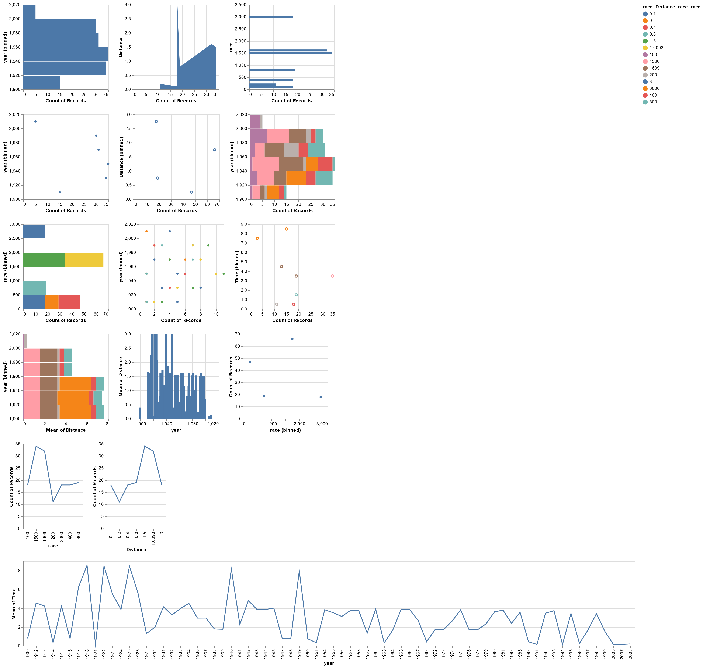

# Data2Vis-PyTorch README

## Overview

This repository contains a Jupyter Notebook implementation of the Data2Vis model, based on the original research paper. The notebook is designed to reproduce the results presented in the paper, demonstrating how machine learning can be used to automatically generate visualizations from data. The code was able to reproduce the same loss achieved in the original paper and produced similar visualizations.



## Getting Started

### Prerequisites

To run the notebook in this repository, you will need:

- Python 3.x
- PyTorch
- Jupyter Notebook
- Tqdm
- Seaborn

### Installation

1. Clone the repository:
   ```
   git clone https://github.com/vnnm404/data2vis-pytorch.git
   ```
2. Navigate to the cloned repository:
   ```
   cd data2vis-pytorch
   ```

### Running the Notebook

1. Launch Jupyter Notebook:
   ```
   jupyter notebook
   ```
2. Open the `Data2Vis-PyTorch.ipynb` notebook.
3. Run the cells in the notebook to see the implementation and results.

## Contact

For any queries regarding this repository, please open an issue in the GitHub repository.
